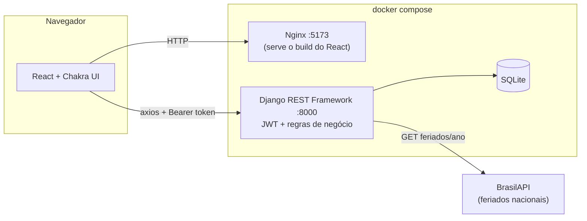

# To-Do App

Teste técnico para vaga de Desenvolvedor Python (Back-end), com a AdviceHealth. É um gerenciador de tarefas com categorias, compartilhamento entre usuários, filtros, paginação e uma integração com API externa (feriados nacionais).

Back-end em Django REST Framework, front-end em React + TypeScript, tudo rodando via Docker Compose.

## Como funciona (visão geral)



O front nunca fala com o banco nem com a API externa diretamente — tudo passa pelo Django, que também cuida de autenticação, permissões e das regras de compartilhamento de tarefas.

## Rodando o projeto

A forma mais rápida é com Docker Compose, na raiz do repositório:

```bash
docker compose up --build
```

- Front: http://localhost:5173
- API: http://localhost:8000/api

Primeiro acesso: crie uma conta em `/register`, depois já cai direto na tela de tarefas.

### Sem Docker

**Backend** (dentro de `BACKEND/`):

```bash
python -m venv venv
source venv/bin/activate  # Windows: venv\Scripts\activate
pip install -r requirements.txt
python manage.py migrate
python manage.py runserver
```

**Frontend** (dentro de `FRONTEND/`):

```bash
npm install
npm run dev
```

O front espera a API em `http://localhost:8000/api` (configurado em `src/api/client.ts`).

### Rodando os testes do backend

```bash
cd BACKEND
pytest -v
```

### Rodando os testes end-to-end (Selenium)

Testam o fluxo real no navegador: cadastro, login, criação/conclusão/exclusão de tarefa e criação de categoria. Precisam da aplicação rodando (via `docker compose up` ou `npm run dev` + `manage.py runserver`) e de um Chrome instalado — o próprio Selenium (Selenium Manager) resolve o chromedriver certo automaticamente.

```bash
cd e2e
pip install -r requirements.txt
pytest -v
```

Por padrão apontam pra `http://localhost:5173`; pra testar outra URL, define `E2E_BASE_URL` antes de rodar.

## Variáveis de ambiente (backend)

| Variável | Padrão | Pra que serve |
|---|---|---|
| `SECRET_KEY` | chave de dev | chave do Django, troca em produção |
| `DEBUG` | `True` | |
| `DATABASE_PATH` | `db.sqlite3` local | caminho do banco (no Docker fica num volume) |
| `CORS_ALLOWED_ORIGINS` | `localhost:5173` | origem liberada pra chamar a API |

## Estrutura

```
todo-app/
├── BACKEND/
│   ├── config/          # settings, urls raiz
│   ├── accounts/        # usuário customizado + login/registro (JWT)
│   ├── categories/      # CRUD de categorias
│   ├── tasks/           # CRUD de tarefas, compartilhamento, filtros
│   ├── external_api/    # integração com a BrasilAPI (feriados)
│   └── Dockerfile
├── FRONTEND/
│   ├── src/
│   │   ├── api/          # chamadas HTTP (axios)
│   │   ├── components/   # componentes reutilizáveis
│   │   ├── contexts/     # auth, tema
│   │   ├── hooks/
│   │   ├── pages/        # Login, Registro, Tarefas
│   │   └── theme.ts      # paleta de cor customizada
│   └── Dockerfile
├── e2e/                  # testes end-to-end (Selenium + pytest)
├── .github/workflows/    # CI
└── docker-compose.yml
```

Cada app do Django segue o mesmo padrão interno: `models.py` → `serializers.py` → `views.py` → `urls.py`, com os testes em `tests/`. Não é por regra nenhuma, é só o jeito mais fácil de qualquer pessoa (inclusive eu, seis meses depois) achar onde mexer.

## Decisões de arquitetura

**SQLite em vez de Postgres.** Escolha deliberada pra manter o `docker compose up` leve e sem serviço extra pra subir. O acesso ao banco fica isolado em `DATABASES`, então trocar por Postgres é questão de configuração, não de refatoração — não tem acoplamento com SQLite em nenhum outro lugar do código.

**JWT no `localStorage`.** Mais direto de implementar num SPA sem lidar com CSRF entre origens diferentes. O trade-off (exposição a XSS) é conhecido; em produção, o próximo passo natural seria mover pra cookie `httpOnly` com SameSite configurado.

**Categorias não são paginadas, tarefas são.** Categoria é uma lista curta que a sidebar mostra inteira de uma vez; tarefa cresce sem limite natural. Cada recurso segue a paginação que faz sentido pro seu próprio volume de dados.

**Tarefa compartilhada: dono tem controle total, quem recebe só marca como concluída.** O enunciado não especifica granularidade, então defini essa regra pra evitar que duas pessoas editem a mesma tarefa em paralelo sem nenhum tipo de controle de conflito.

**API externa: feriados nacionais via BrasilAPI.** Integrada direto no fluxo de criação de tarefa — ao definir uma data de vencimento, o front avisa se cai num feriado. Preferi isso a um endpoint solto sem relação com o resto do app.

## Próximos passos

- Mover o JWT para cookie `httpOnly` com SameSite configurado, reduzindo a superfície de exposição a XSS.
- Estender o tema "Cute" para bordas e tipografia, além da paleta de cor.
- Rodar os testes end-to-end também no CI (hoje o pipeline cobre pytest e lint/build do front; o Selenium fica de fora porque exige a aplicação rodando com Chrome disponível no runner).

## Stack

Backend: Django 6 + Django REST Framework, `djangorestframework-simplejwt`, `django-filter`, `django-cors-headers`, pytest.

Frontend: React 19 + TypeScript, Vite, Chakra UI v3, React Router, axios.

Testes end-to-end: Selenium + pytest.

Infra: Docker + Docker Compose (Nginx servindo o build do front, Gunicorn rodando o back), GitHub Actions (CI).
